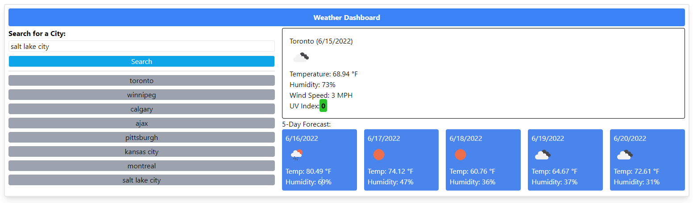

# Weather Dashboard

A weather dashboard displaying the weather and forecast of any city that is searched. Using the One Call API from [Open Weather](openweathermap.org), the current weather and forecast data is displayed alongside a 5-day weather forecast. A search history has also been implemented to show your past searches, allowing the user to better plan their trips across multiple cities if needed.

#### Website Preview

## Link 
The link to the deployed website can be found here:
[Weather Dashboard](https://tahir-arslan.github.io/Weather-Dashboard/)